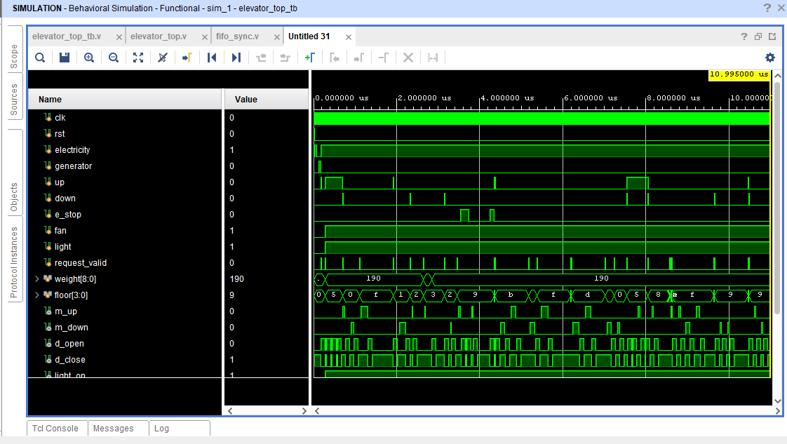

# 🛗 Smart Elevator Controller with FIFO Scheduling (Verilog)

## 📌 Project Overview

This project implements an **industry-style Smart Elevator Controller** using **Verilog HDL**, combining a **Finite State Machine (FSM)** with a **FIFO-based request scheduler** to model real-world elevator systems.

Unlike basic designs, this system introduces **queued request handling**, ensuring that multiple floor requests are processed **sequentially, reliably, and without loss**, similar to commercial elevator controllers.

The design emphasizes **robustness, safety, and determinism**, making it a strong demonstration of **RTL design, digital system architecture, and verification skills**.

---

## 🚀 Key Highlights (Why this is Top-Level)

* 📥 **FIFO-based request scheduling** (real-world feature)
* 🧠 **FSM-based control logic with 9 states**
* 🔄 **Deterministic request servicing (no duplication / no skipping)**
* ⚠️ **Safety-first design**

  * Emergency stop
  * Overweight protection
  * Power failure handling
* 🧪 **22 comprehensive test cases**
* 🖥️ **Waveform + simulation log validation**
* 🧩 **Modular RTL architecture**

---

## 🧠 System Architecture

```text
User Requests → FIFO Queue → Target Floor Logic → Elevator FSM → Outputs
```

### 📦 Modules

| Module            | Description                             |
| ----------------- | --------------------------------------- |
| `fifo_sync`       | Stores and sequences floor requests     |
| `elevator`        | FSM controlling movement, safety, doors |
| `elevator_top`    | Integrates FIFO + FSM                   |
| `elevator_top_tb` | Testbench with 22 scenarios             |

---

## 📥 FIFO-Based Scheduling (Core Innovation)

### Problem Solved:

Traditional elevator FSM:
❌ Cannot handle multiple requests efficiently
❌ May lose or overwrite requests

### Solution:

✔ FIFO queue stores incoming requests
✔ Requests processed in **order of arrival (FIFO)**

### Features:

* Depth: 8
* Data width: 4-bit (floor)
* Full / Empty detection
* `data_valid` ensures **single-cycle safe read**

---

## 🔁 Request Control Logic

### Smart Scheduling Mechanism:

A **request_pending flag** ensures:

* Only **one request is active at a time**
* Prevents **multiple reads of same FIFO data**
* Guarantees **complete execution before next request**

---

## 🧠 FSM Design

### States Implemented:

| State               | Function               |
| ------------------- | ---------------------- |
| `electricity_check` | Power failure handling |
| `idle`              | Waiting state          |
| `move_up`           | Upward motion          |
| `move_down`         | Downward motion        |
| `door_open`         | Door open              |
| `weight_check`      | Load verification      |
| `alarm`             | Overweight condition   |
| `door_close`        | Door closing           |
| `emergency_stop`    | Emergency halt         |

---

## ⚡ Power Handling

| Condition                      | Behavior                  |
| ------------------------------ | ------------------------- |
| Electricity = 0, Generator = 0 | System pauses             |
| Power restored                 | Returns to previous state |

✔ Ensures **safe recovery without state corruption**

---

## ⚖️ Overweight Protection

```
weight ≥ 500
```

* Movement disabled
* Alarm activated
* Resumes only after safe weight

---

## 🚨 Emergency Stop

```
e_stop = 1
```

* Immediate halt (Lift stops in nearest floor without reaching to target_floor when e_stop=1)
* Transitions to safe state
* Door opens automatically

---

## 🚪 Door Control Logic

* Opens at target floor
* Timer-based (~10 clock cycles)
* Auto-closes after timeout

---

## 🎯 Target Floor Handling

* Updated **only after FIFO valid read**
* Prevents:

  * Request skipping
  * Duplicate servicing

---

## 📊 Simulation Waveform

The waveform verifies:

* FSM transitions
* FIFO read/write behavior
* Floor movement
* Door operations
* Safety conditions



---

## 🖥️ Simulation Log Output

The simulation log provides **cycle-accurate debugging visibility**:

### Includes:

* Current state
* Current floor
* Target floor
* Request status
* Control signals
* Safety flags

### Sample:

```
T=100 | floor=5 CUR_FLOOR=0 TARGET=5 req=1 state=move_up | UP=1 DOWN=0
T=200 | floor=5 CUR_FLOOR=1 TARGET=5 req=0 state=move_up | UP=1 DOWN=0
T=300 | floor=5 CUR_FLOOR=5 TARGET=5 req=0 state=door_open | DO=1 DC=0
```

📄 Full logs: `simulation_log.txt`

---

## 🧪 Testbench Coverage (22 Cases)

### ✔ Functional Tests

* Movement (up/down)
* Same-floor request
* Sequential requests

### ✔ FIFO Tests

* Multiple simultaneous requests
* Continuous request injection

### ✔ Safety Tests

* Overweight condition
* Emergency stop (idle + movement)

### ✔ Edge Cases

* Up & Down conflict
* Rapid floor changes
* Mixed inside/outside calls

---

## 🔧 Design Methodology

✔ Synchronous design (posedge clk)
✔ Clean separation:

* State Register
* Next-State Logic
* Output Logic

✔ Parameterized FIFO
✔ Hierarchical modular design

---

## 🎯 Priority Handling

```
Emergency > Power Failure > Overweight > Normal Operation
```

---

## 📂 Project Structure

```text
elevator-fifo-controller/
│
├── fifo_sync.v
├── elevator.v
├── elevator_top.v
├── elevator_top_tb.v
├── simulation_log.txt
├── README.md
└── images/
    └── waveform.png
```

---

## 🚀 How to Run (Vivado)

1. Open project in **Xilinx Vivado**
2. Add RTL and testbench files
3. Run: **Run Behavioral Simulation**
4. Observe:
   → Waveforms
   → Console output

---

## 🛠️ Tools Used

* Verilog HDL
* Xilinx Vivado

---

## 📈 Skills Demonstrated

* RTL Design
* FSM Design
* FIFO Design
* Digital System Architecture
* Verification & Debugging
* Edge Case Handling

---

## 👨‍💻 Author

**SHAIK ABDUL MATHEEN**

---

## ## 📌 Acknowledgement

This project demonstrates *advanced RTL design concepts* including:

* FSM Design
* FIFO-Based Scheduling
* Real-World System Modeling
* Hardware Verification using Testbench

It is a strong example of *industry-level digital design thinking*.
